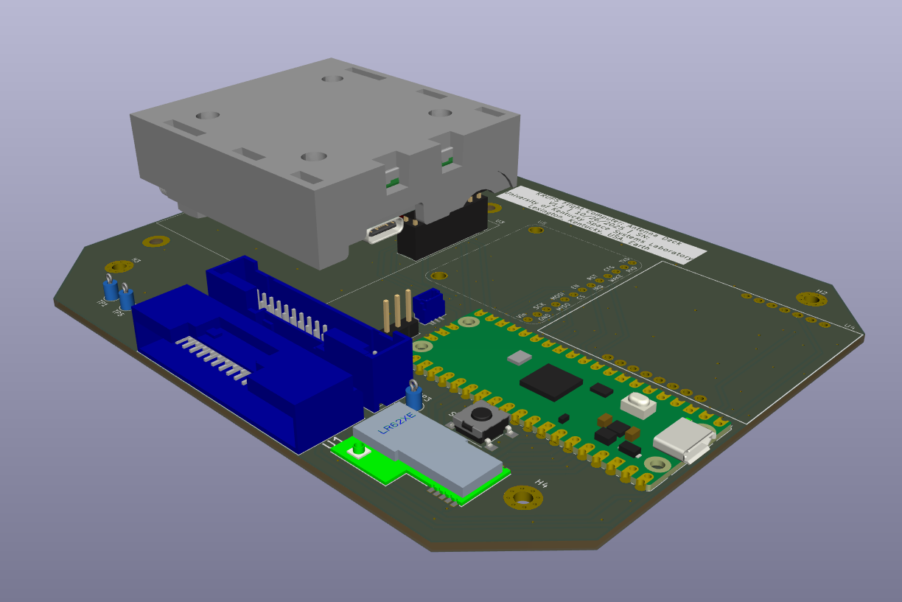

# Portfolio
This is a collection of projects that I've worked on during my undergraduate studies.
If you're interested in hearing more about a particular project, feel free to email me at milen.mikov@uky.edu

## KREPE-3 Flight Computer
I designed the full flight computer stack used in the University of Kentucky's upcoming 2026 flight of the [Kentucky Re-entry Universal Payload System (KRUPS)](https://research.uky.edu/news/departments-mae-and-ece-make-history-5-capsules-successful-return-space) Hypersonic Re-entry vehicle.

This included schematic capture and a completely new PCB layout which was optimized for ease of assembly and debugging. I also created all of the wiring harnesses used in the capsule.

Examples of these designs can be seen below.

### Flight Computer PCB
The PCB which contains the capsule's main flight computer, sensors, power management circuitry, and signal passthroughs to the bottom of the internal housing.

### Antenna Deck PCB
The PCB which contains all of the capsule's radio equipment, and signal passthroughs to the top of the internal housing.

### Example Harness

## UKY RockSatX-G Mission
I designed, assembled, and brought up the femtosat and RocketStation PCBs used in the University of Kentucky's 2025 RockSatX-G sounding rocket launch.

These were both clean slate designs, intended to demonstrate radio mesh networks between simulated capsules.

Full design files for both can be found in [this repository](https://github.com/krups/RockSatX-GHOST-Hardware).

### Femtosat
Small PCB designed to gather data and transmit it through a radio mesh network. A total of 8 of these will be jetisoned from the sounding rocket after launch.

### RocketStation
A Raspberry Pi hat which received and downlinked transmissions from the femtosat network, while also powering a Raspberry Pi 5 and its associated camera module.

